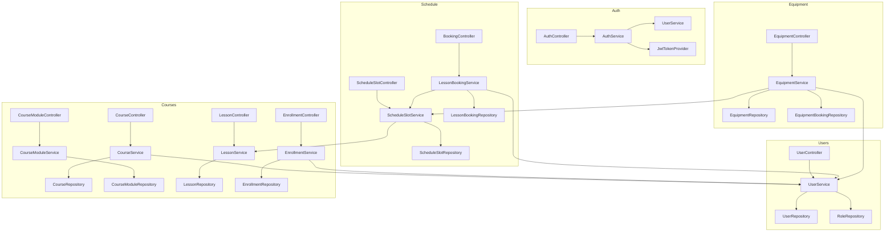
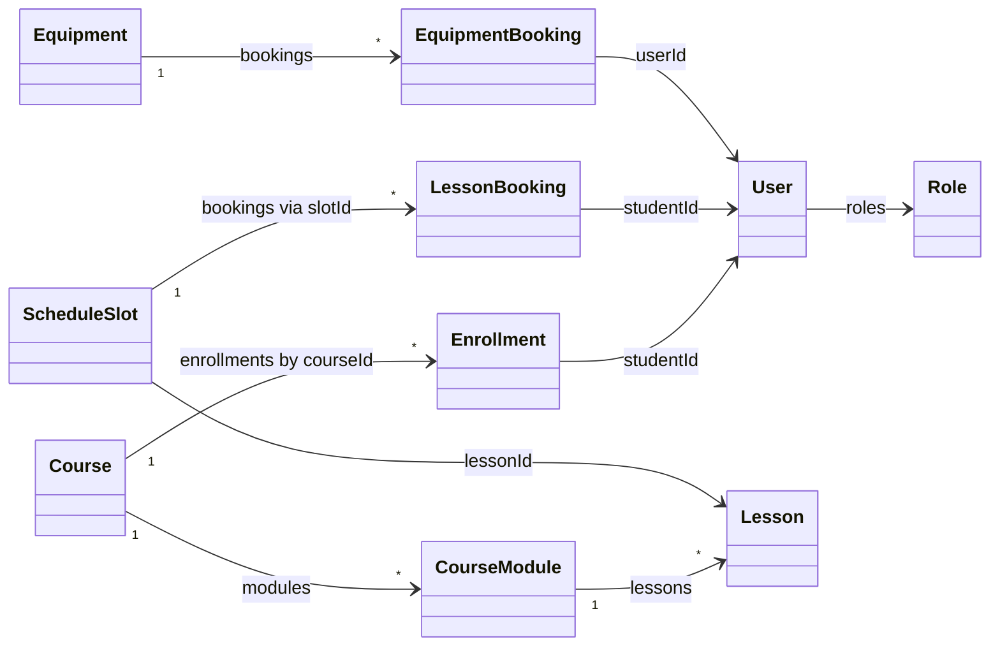

# Backend Architecture Diagrams

This document summarizes the backend structure with Mermaid diagrams for packages, modules (controller-service-repository slices), and core domain classes.

## Package Overview

```mermaid
flowchart LR
    subgraph config[config]
        SecurityConfiguration
        AsyncConfig
        DataInitializer
    end

    subgraph common[common]
        ApiError
        BusinessException
    end

    subgraph auth[auth]
        AuthController
        AuthService
        subgraph security[auth.security]
            JwtTokenProvider
            JwtAuthenticationFilter
            CustomUserDetailsService
        end
    end

    subgraph user[user]
        UserController
        UserService
        UserRepository
        RoleRepository
    end

    subgraph course[course]
        CourseController
        CourseModuleController
        LessonController
        EnrollmentController
        CourseService
        CourseModuleService
        LessonService
        EnrollmentService
        CourseRepository
        CourseModuleRepository
        LessonRepository
        EnrollmentRepository
    end

    subgraph schedule[schedule]
        ScheduleSlotController
        BookingController
        LessonControllerSched[LessonBookingService]
        ScheduleSlotService
        LessonBookingRepository
        ScheduleSlotRepository
    end

    subgraph equipment[equipment]
        EquipmentController
        EquipmentService
        EquipmentRepository
        EquipmentBookingRepository
    end

    config --> auth
    config --> user
    config --> course
    config --> schedule
    config --> equipment

    auth --> user
    course --> schedule
    course --> user
    schedule --> user
    equipment --> user
    equipment --> schedule
    common --> auth
    common --> course
    common --> schedule
    common --> equipment
```

## Module (Layer) Interaction
Each vertical slice follows the same controller → service → repository pattern. The diagram highlights dependencies between slices where they cross boundaries.

## Core Domain Class Relationships
